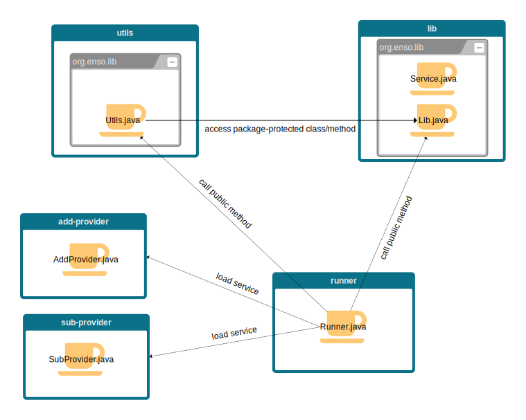

# JPMS demo
This is a simple demo of the Java Platform Module System (JPMS) introduced in Java 9.

You will need a JDK 9+ and Maven to run this demo.

The architecture of the application:



## Fat JAR
Compile everything and assemble the fat jar:
```shell
mvn compile jar:jar install
mvn -f runner package shade:shade
```

Run the fat jar:
```shell
java -jar runner/target/runner-1.0-SNAPSHOT.jar
```

